# 🔧 LibreHardwareMonitorService (LHM)

> **TL;DR**: Access CPU/GPU temperatures and other hardware data on Windows *without* needing to run your app as 🔐 Administrator.

The **LibreHardwareMonitorService** (LHM) project allows you to access hardware information, such as CPU and GPU temperatures, on Windows from user-land code using Rust. Typically, user-land programs cannot directly access hardware information due to operating system restrictions, which require administrator privileges for such actions.

This library overcomes this limitation by installing a service that handles hardware information requests. Instead of requiring the program to access hardware directly, it sends requests to this service, which allows the program to run without administrator permissions. The only time administrator privileges are needed is during the installation of the service.

---

## 🧠 How It Works
1. **Installation:** The user installs the `lhm-service`, which requires administrator permissions to set up.
2. **Service Communication:** The `lhm-service` runs in the background, waiting for requests from user-land applications.
3. **Client Requests:** Your program (using `lhm-client`) sends requests to the service through the named pipe. These requests are passed to the Libre Hardware Monitor library to retrieve hardware data.
4. **Response:** The service responds to the request with the requested hardware data in [MsgPack](https://msgpack.org/) format, allowing your program to access hardware metrics like temperatures without requiring elevated privileges.

```mermaid
flowchart TD
    App["🦀 Rust App<br/>(User Mode - No Admin)"]
    Client["🔌 lhm-client<br/>(Sends MsgPack Request)"]
    Pipe["📡 Named Pipe<br/>\\\\.\\pipe\\LHMLibreHardwareMonitorService"]
    Service["🛎️ lhm-service<br/>(Windows Service)"]
    FFI["🧩 lhm-sys<br/>(Rust ↔ C# Bridge)"]
    Monitor["📈 LibreHardwareMonitorLib<br/>(Reads Hardware Data)"]

    App --> Client
    Client --> Pipe
    Pipe --> Service
    Service --> FFI
    FFI --> Monitor

    Monitor --> FFI
    FFI --> Service
    Service --> Pipe
    Pipe --> Client
    Client --> App
```




---

## Prerequisites

To build `lhm-sys` or `lhm-service`, you need to have the .NET SDK 8.0 installed. You can install it using [winget](https://github.com/microsoft/winget-cli) with the following command:
```
winget install Microsoft.DotNet.SDK.8
```

## 📦  Components

### 🧩 lhm-sys (Bridge)

The `lhm-sys` crate serves as a bridge that connects AOT-compiled Rust code to C# through either static linking or a dynamic link library (DLL). This crate builds C# code that interacts with the [LibreHardwareMonitorLib](https://github.com/LibreHardwareMonitor/LibreHardwareMonitor) project and sets up the FFI layer for communication between Rust and C#.

### 🛎️ lhm-service (Service)

The `lhm-service` is a small Windows service that runs in the background. It runs the `lhm-server` as a windows service.

- **Pre-built installer:** The lhm-service is provided as a pre-built installer through GitHub releases (automatically built by GitHub Actions).
- As a consumer of the lhm-client library, you will likely want to bundle this installer with your application or direct users to install it manually.

You can download the prebuilt installer from [Releases](https://github.com/jacobtread/lhm-service/releases/latest)

### 🛎️ lhm-server (Service)

The `lhm-server` is a small server. It creates a named pipe (`\\.\pipe\LHMLibreHardwareMonitorService`) for communication with user-land applications. The server interacts with Libre Hardware Monitor, providing hardware details to the client over this pipe via MsgPack. 

### 💬 lhm-client (Client)

The `lhm-client` is the client library that interacts with the named pipe created by `lhm-service`. It allows user-land applications to request hardware details (e.g., CPU/GPU temperatures) via the service using MsgPack over the named pipe.
